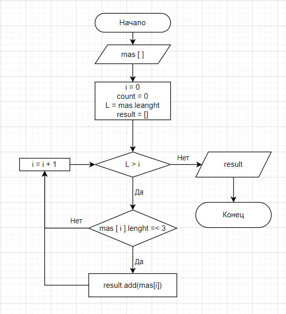

# Инструкция по работе с программой
## Описание основного функционала

1. На вход подается массив со строками разной длины.
2. Создаем пустой массив **result**, в который будем помещать подходящие нам элементы.
3. Из входного массива отберем только те строки, длина которых больше 3х символов.
4. Выводим получившийся массив на экран.

*Завершим работу программы.*

# Блок схема программы

Ссылка на файл в формате [drawio](image/homeWork.drawio)